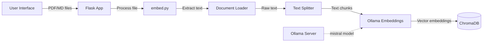
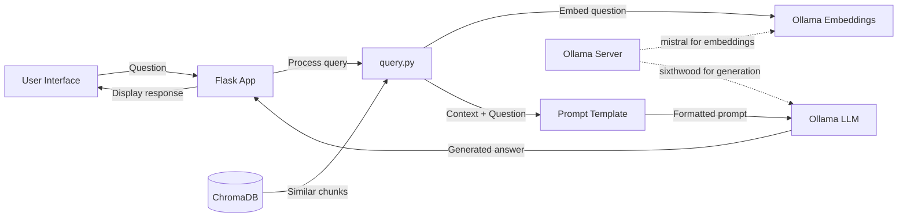

# LocalRAG - Local Retrieval Augmented Generation System

A fully local RAG (Retrieval Augmented Generation) system powered by Ollama. This web application allows you to upload PDF and Markdown documents, process them into a vector database, and then query them using natural language.

## Process for Embedding Documents



## Process for RAG Query Responses



## Features

- 100% local processing - no API keys or external services required
- Support for both PDF and Markdown files
- Multiple file upload with drag-and-drop interface
- Configurable prompt templates to customize response style
- Adjustable temperature to control response creativity
- Database purge functionality for easy maintenance

## Requirements

- Python 3.8+
- [Ollama](https://ollama.ai/) installed locally

## Installation

1. Clone this repository:

```bash
git clone https://github.com/yourusername/localrag.git
cd localrag
```

2. Install dependencies using Pipenv:

```bash
# Install pipenv if you don't have it
pip install pipenv

# Install dependencies
pipenv install

# Activate the virtual environment
pipenv shell
```

3. Make sure you have Ollama installed and running with the required models:

```bash
# Pull Mistral for embeddings
ollama pull mistral

# Optional: Pull or create custom models
ollama pull llama3
```

## Configuration

The application can be configured using environment variables or a `.env` file:

```py
# Model settings
EMBEDDING_MODEL=mistral
LLM_MODEL=mistral

# Close to 0 is factual and close to 1 is creative
LLM_TEMPERATURE=1.0

# HTTP server settings
PORT=8080
DEBUG=false

# Path settings
TEMP_FOLDER=./_temp
CHROMA_PERSIST_DIR=./chroma_db
PROMPT_TEMPLATES_PATH=./prompt_templates.json
TEMPLATE_PATH=./template.html

# Ollama settings
OLLAMA_BASE_URL=http://localhost:11434

# Increase this to "cast a wider net" when querying
RETRIEVAL_K=4

# Your choice of prompt from prompt_templates.json
PROMPT_TEMPLATE=standard
```

## Customizing Prompt Templates

Prompt templates can be customized by editing the `prompt_templates.json` file. The file will be created with default templates on first run.

Example template format:

```json
{
  "standard": "Answer the question based only on the following context...",
  "creative": "Use your expertise to answer the following question...",
  "technical": "Provide a technical analysis of the following question..."
}
```

## Usage

1. Start the application:

```bash
# If you're in the pipenv shell
python app.py

# Or use the script
pipenv run start
```

2. Open your browser to `http://localhost:8080`

3. Upload PDF or Markdown files:
   - Drag and drop files into the drop zone, or
   - Click to select files

4. Query your documents:
   - Enter your question
   - Select a response style (Standard, Creative, etc.)
   - Adjust temperature as needed (0-1)
   - Click "Submit Query"

5. Optional: Purge database if needed (in the admin section)

## Customizing the User Interface

The user interface is defined in a single HTML file (`template.html`) that can be easily modified to suit your needs:

1. **Modifying the template**:
   - Edit the `template.html` file directly
   - Changes will be reflected the next time you reload the page

2. **Styling**:
   - CSS styles are defined in the `<style>` section at the top of the HTML file
   - Modify colors, sizes, spacing, etc. to match your preferred aesthetic

3. **Custom template location**:
   - By default, the application looks for `template.html` in the project root directory
   - You can specify a different location by setting the `TEMPLATE_PATH` environment variable:
     ```
     TEMPLATE_PATH=/path/to/your/custom-template.html
     ```

4. **Template sections**:
   - Query section: For asking questions about embedded documents
   - Upload section: For uploading and embedding new documents
   - Admin section: For database management

The template is loaded dynamically on each request, so you don't need to restart the server when making changes to the HTML.

## Contributing

Contributions are welcome! Please feel free to submit a Pull Request.

## License

This project is licensed under the MIT License - see the LICENSE file for details.